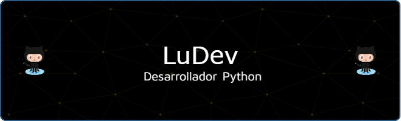

<h1 align="center">¡Bievenido/a! </h1>

    

    
    
    
    
    

Bienvenidos a mi Perfíl de Github!  
Soy Lucas, <b>Desarrollador Python</b> y <b>Creador de Contenido</b> de Argentina 

> ⭐ ¿Te gustaría aprender a programar desde cero de una forma fácil y divertida? 🚀
>
> Te invito a visitar mi canal de [YouTube](https://www.youtube.com/@codewithludev), donde comparto contenido gratuito y accesible para que puedas empezar sin complicaciones. ¡Echa un vistazo aquí abajo! 👇

## 📹 Ultimos videos de mi [canal de YouTube](https://www.youtube.com/@codewithludev)
<!-- BEGIN YOUTUBE-CARDS -->

<!-- END YOUTUBE-CARDS -->

___
### Todas las Herramientas que uso/usé:

🧑‍💻 Lenguajes 
---

💾 Databases
---

📚 Frameworks, Plataformas y Librerias
---

🕓 Control de Versiones
---

🖥️ML/DL
---

🎨 Diseño
---

